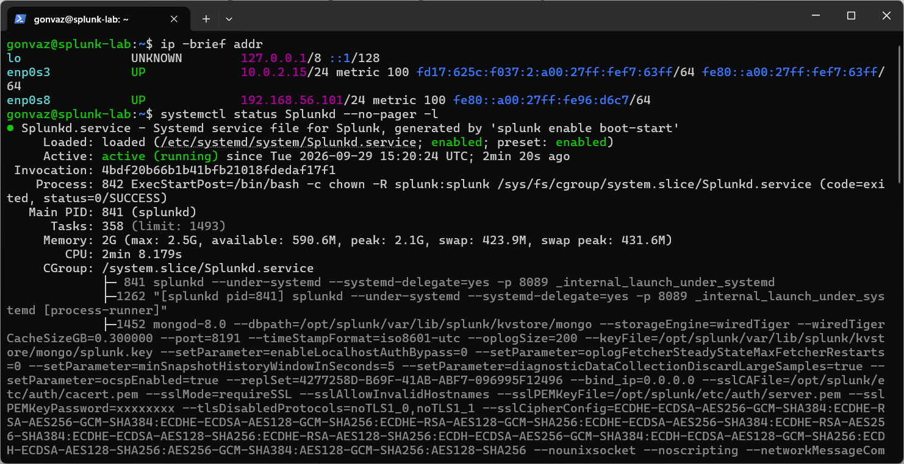
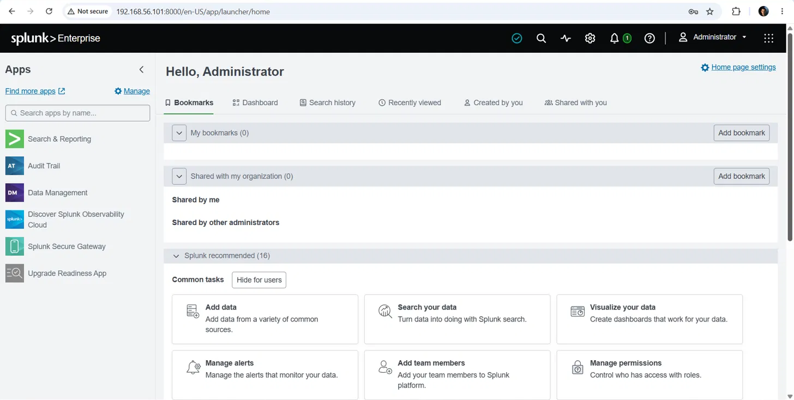

# SOC Home Lab

A virtualized Security Operations Center lab built on my own PC to practice **SOC Analyst L1** skills: log collection, alert triage, threat investigation, and incident documentation.

## Lab Architecture

```
Windows 11 host (16 GB RAM) — VirtualBox
│
├── splunk-server   Ubuntu Server 26.04 LTS  (3 GB RAM, 2 vCPU, 50 GB)
│   └── Splunk Enterprise 10.4.3 — SIEM, receiving on port 9997
│
└── win10-victim    Windows 10 Enterprise LTSC  (in progress)
    └── Sysmon + Splunk Universal Forwarder → sends logs to Splunk

Network: NAT (internet) + Host-only 192.168.56.0/24 (isolated lab traffic)
```

## Tools

| Tool | Role in the lab |
|------|-----------------|
| **Splunk Enterprise** | SIEM: collects, stores, and searches logs; alerts and dashboards |
| **Sysmon** | Detailed Windows endpoint telemetry (processes, network, files) |
| **Splunk Universal Forwarder** | Ships Windows and Sysmon logs to Splunk |
| **Atomic Red Team** | Simulates real attacker techniques (MITRE ATT&CK) to detect |
| **VirusTotal** | Threat intel lookups for hashes, IPs, and domains |
| **Wireshark** | Packet-level network traffic analysis |

## Progress Log

### Day 1: Splunk server
- Built an Ubuntu Server VM in VirtualBox with dual network adapters (NAT + Host-only).
- **Issue:** the Ubuntu installer's default LVM layout allocated only 24 GB of the 50 GB disk. Reconfigured storage without LVM to use the full disk (Splunk stops indexing when free space runs low).
- Installed Splunk Enterprise 10.4.3.
- **Issue:** Splunk 10 refuses to run as root. Fixed it by running Splunk under a dedicated `splunk` service account and enabling systemd-managed boot-start, following least-privilege practice.
- Configured a receiving port (9997) and created a `windows` index for endpoint logs.




### Day 2: Windows victim VM
*In progress.*

## Incident Write-ups

Investigations of simulated attacks are documented in [`/writeups`](writeups/).

| # | Title | Technique | Verdict |
|---|-------|-----------|---------|
| — | *Coming soon* | | |

## Skills Practiced
- Linux server administration (Ubuntu, systemd, service accounts)
- SIEM deployment and configuration (Splunk)
- Virtual networking and lab isolation
